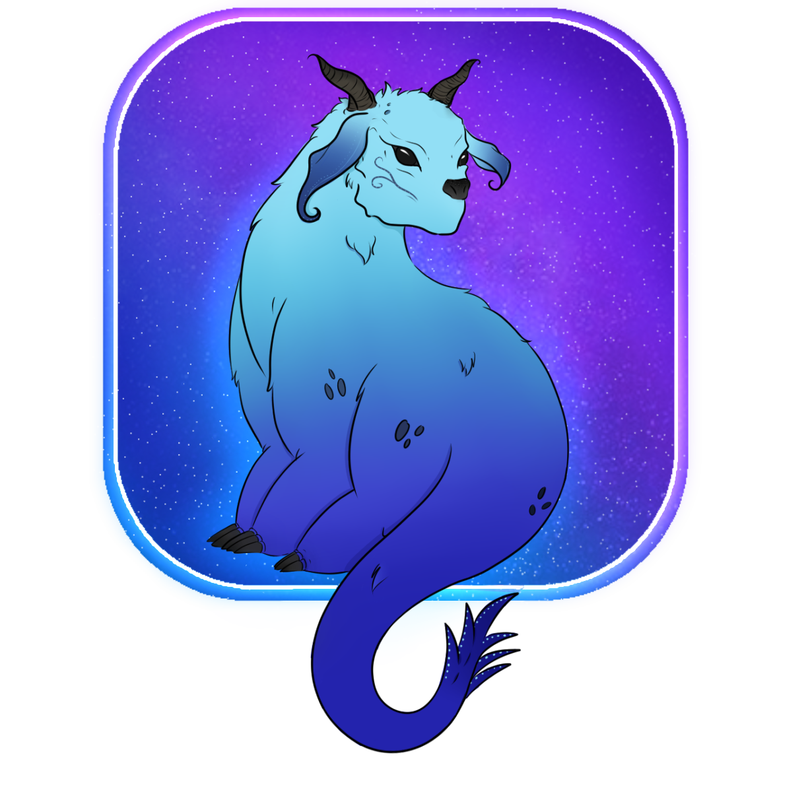

# DistarArt

**Plataforma web para artistas digitales** · Gestor de encargos para artistas digitales

*El espacio donde cada trazo cuenta y cada encargo es una historia.*

 

 

*Proyecto final para la asignatura de Diseño de Aplicaciones Web.*

---

## ¿Qué es DistarArt?

DistarArt es una **aplicación web para artistas digitales** que gestionan encargos (commissions). En lugar de andar con hojas de cálculo o conversaciones dispersas por Instagram, aquí tienes todo centralizado: tus encargos, el estado de cada uno, los datos de tus clientes, tu portfolio y hasta un sistema de logros.

Está pensada para artistas independientes que reciben encargos de ilustración, diseño de personajes u otras disciplinas creativas, y quieren llevar un control real de su trabajo.

---

## ✦ Vistas principales

### 🔐 Autentificación
- Login y registro de cuentas de artista
- Checkbox **"Recuérdame"** que persiste la sesión en cookies
- Imagen de fondo aleatoria en cada inicio de sesión

### 🖼️ Portfolio
- Grid visual con todos los encargos del artista
- Etiqueta de estado visible en cada tarjeta
- Filtro por estado + buscador en tiempo real por nombre

### 📋 Gestión
- Vista detallada con datos completos del cliente (nombre, email, dirección, presupuesto)
- Crear y editar encargos desde una ventana auxiliar

### 👤 Perfil
- Edición de descripción, especialidad y ubicación
- Foto de perfil individual por artista
- Gestión de redes sociales: **Instagram, TikTok, Pinterest y X**

---

## 🎯 Sistema de fases

Cada encargo tiene **8 fases** que representan su progreso, cada una con su propio color en la interfaz:

| # | Fase | Color |
|:-:|------|:-----:|
| 1 | Lluvia de ideas | `#ebbefd` |
| 2 | Pruebas | `#d07cf1` |
| 3 | Bocetado | `#bc46eb` |
| 4 | Revisión | `#8937e7` |
| 5 | Corrección | `#6952eb` |
| 6 | Desarrollo | `#6696fd` |
| 7 | Detallado | `#9dd8ff` |
| 8 | Finalizado | `#83ecff` |

---

## 🏆 Sistema de logros

Los logros se desbloquean automáticamente según la actividad del artista:

| Logro | Condición |
|-------|-----------|
| 🖊️ Primer trazo | Recibir el primer encargo |
| ⭐ Popular | Acumular 3 o más encargos |
| 📦 Coleccionista | Acumular 5 o más encargos |
| 🔀 Multitarea | Trabajar con 3 o más clientes distintos |
| 🖨️ Imprenta humana | Completar 5 o más proyectos |

---

## 🎨 Paleta de diseño

| Variable | Color | Uso |
|----------|:-----:|-----|
| `--color-principal` | `#6c5ce7` | Morado principal de la marca |
| `--color-secundario` | `#0984e3` | Azul de acento |
| `--color-principal-claro` | `#ead7ff` | Fondos y superficies suaves |
| `--degradado-fondo` | `#ecf8fd → #d2f5ff` | Fondo general de la app |
| `--fuente-base` | Plus Jakarta Sans | Títulos y cabeceras |

---

## 🚀 Puesta en marcha

Necesitas un servidor local con soporte PHP — por ejemplo **XAMPP** o **Laragon**.

1. Coloca el proyecto en `htdocs/` (o equivalente)
2. Abre el navegador en `http://localhost/.../PROYECTO-FINAL-DISTARART-ENCARGOS/`

### Cuentas de prueba

Todas usan la contraseña `2daw`:

| Nick | Artista | Especialidad |
|------|---------|-------------|
| `diwin_art` | Diana Romero | Ilustración digital y diseño gráfico |
| `carles_dalmau` | Carles Dalmau | Ilustración digital y diseño de personajes |
| `colorful_and_wild` | Jess | Character Design (CSP) |
| `karo_line_art` | Karo | Ilustración tradicional |

---

 

*Proyecto final de DAW — Diseño de Aplicaciones Web · 2ºDAW*

 

